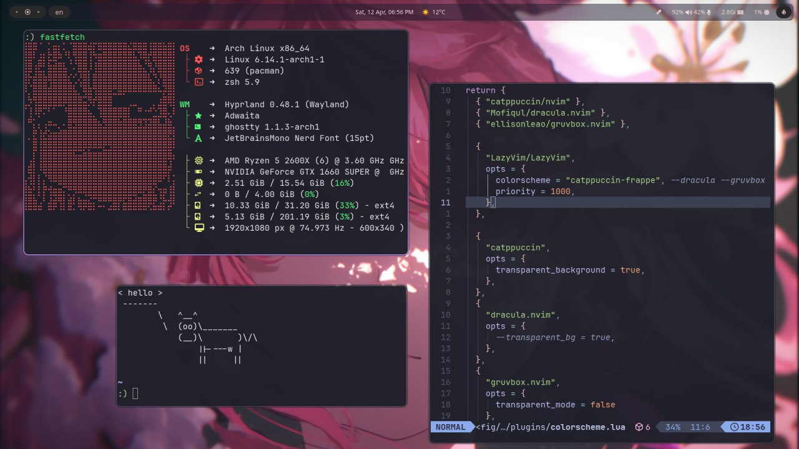

<!-- <h1 align="center"> Minimal Bocchi</h1> -->

  <h1>My simple rice</h1>

## 📦 Programs

List of programs and tools I use.

| Component         | Program    |
|-------------------|------------|
| Windows Manager 🪟| [hyprland](https://github.com/hyprwm/Hyprland)  |
| Terminal 🖥️       | [ghostty](https://github.com/ghostty-org/ghostty)        |
| Shell 🐚          | [zsh](https://github.com/ohmyzsh/ohmyzsh/wiki/Installing-ZSH) / [starship](https://github.com/starship/starship) |
| File Manager 📁   | [thunar](https://wiki.archlinux.org/title/Thunar)      |
| Editor 📝         | [neovim](https://github.com/neovim/neovim) / [lazyvim](https://www.lazyvim.org/)|
| Browser 🌐        | [zen](https://zen-browser.app/) |
| Bar 📊            | [waybar](https://github.com/Alexays/Waybar)      |
| Launcher 🚀       | [rofi](https://github.com/davatorium/rofi)          |
| Color Theme 🎨    | [pywal](https://github.com/dylanaraps/pywal) |
| Lockscreen 🔒     | [hyprlock](https://github.com/hyprwm/hyprlock)  |
| Login Menu 🚪     | [sddm](https://github.com/sddm/sddm)          |
| Sound 🎤         | [pipiwire with pulseaudio](https://github.com/raitonoberu/sptlrx)      |
| Notify ?         | [dunst](https://github.com/dunst-project/dunst)      |
| Wallpaper ?       | [swww](https://github.com/LGFae/swww)      |

## 🎸 Preview

